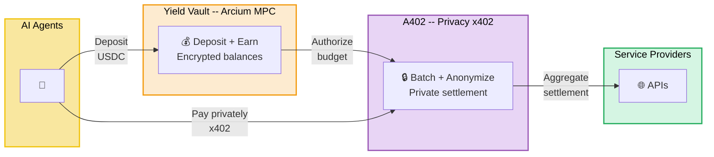
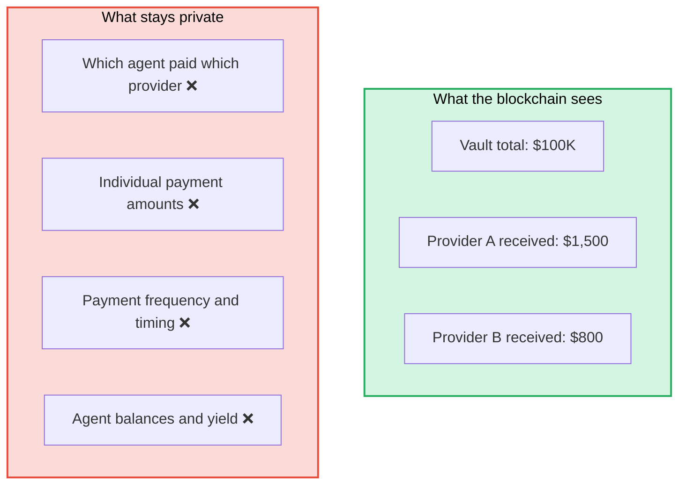
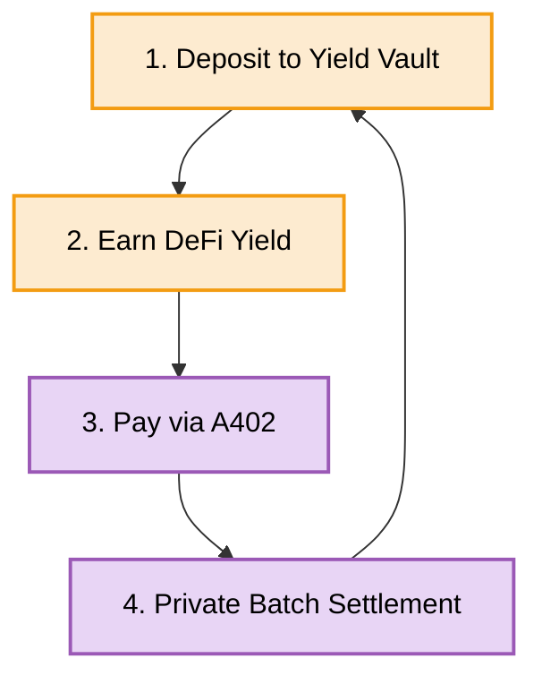
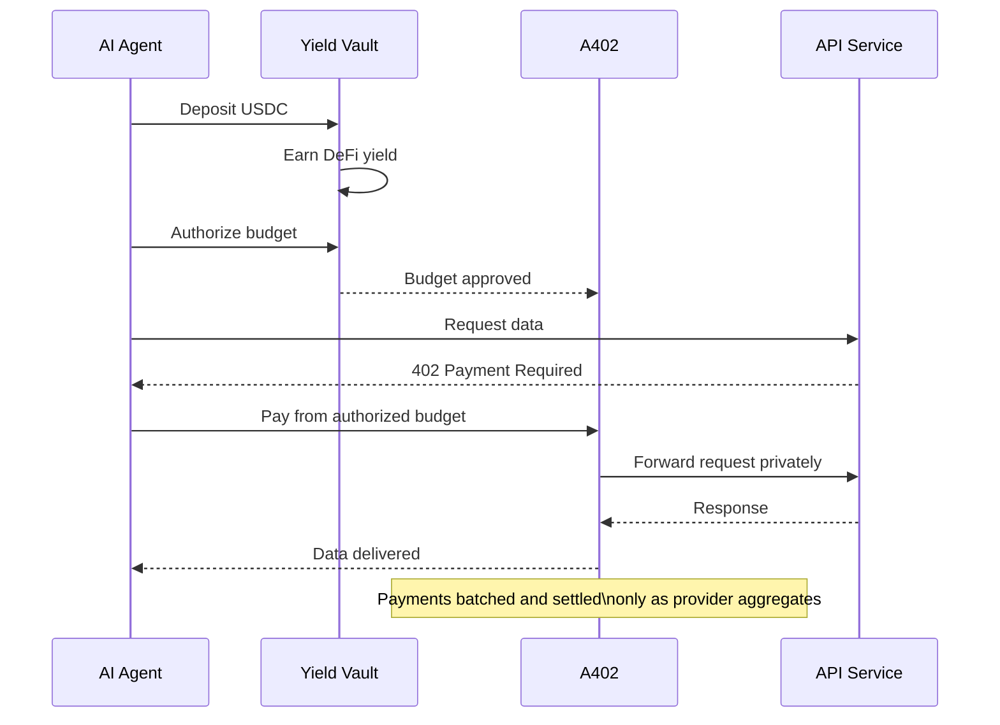
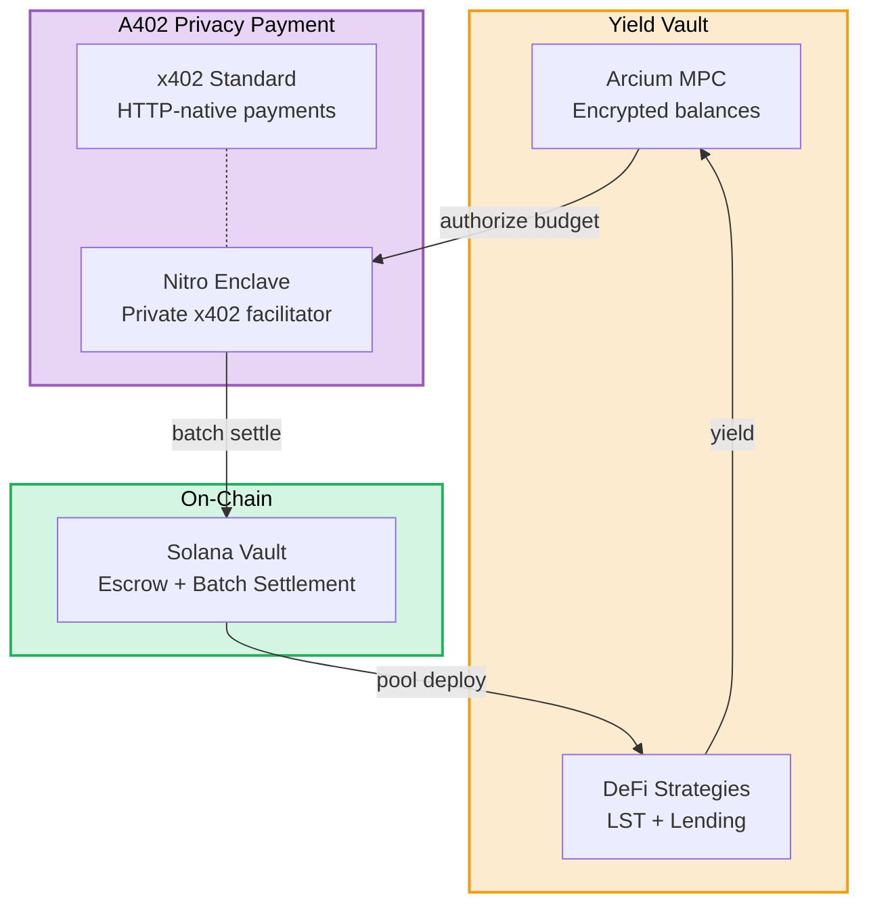

# A402 Architecture

## How It Works

```mermaid
graph LR
    subgraph agents["AI Agents"]
        A["🤖"]
    end

    subgraph vault["Yield Vault -- Arcium MPC"]
        V["💰 Deposit + Earn\nEncrypted balances"]
    end

    subgraph a402["A402 -- Privacy x402"]
        PRIV["🔒 Batch + Anonymize\nPrivate settlement"]
    end

    subgraph providers["Service Providers"]
        P["🌐 APIs"]
    end

    A -- "Deposit\nUSDC" --> V
    V -- "Authorize\nbudget" --> PRIV
    A -- "Pay privately\nx402" --> PRIV
    PRIV -- "Aggregate\nsettlement" --> P

    style agents fill:#f9e79f,stroke:#f1c40f,stroke-width:2px,color:#000
    style vault fill:#fdebd0,stroke:#f39c12,stroke-width:2px,color:#000
    style a402 fill:#e8d5f5,stroke:#9b59b6,stroke-width:2px,color:#000
    style providers fill:#d5f5e3,stroke:#27ae60,stroke-width:2px,color:#000
```

## Privacy: What's Visible vs Hidden

```mermaid
graph TB
    subgraph onchain["What the blockchain sees"]
        O1["Vault total: $100K"]
        O2["Provider A received: $1,500"]
        O3["Provider B received: $800"]
    end

    subgraph hidden["What stays private"]
        H1["Which agent paid which provider ❌"]
        H2["Individual payment amounts ❌"]
        H3["Payment frequency and timing ❌"]
        H4["Agent balances and yield ❌"]
    end

    style onchain fill:#d5f5e3,stroke:#27ae60,stroke-width:2px,color:#000
    style hidden fill:#fadbd8,stroke:#e74c3c,stroke-width:2px,color:#000
```

## The PayFi Loop

```mermaid
graph TB
    D["1. Deposit to Yield Vault"] --> Y["2. Earn DeFi Yield"]
    Y --> P["3. Pay via A402"]
    P --> S["4. Private Batch Settlement"]
    S --> D

    style D fill:#fdebd0,stroke:#f39c12,stroke-width:2px,color:#000
    style Y fill:#fdebd0,stroke:#f39c12,stroke-width:2px,color:#000
    style P fill:#e8d5f5,stroke:#9b59b6,stroke-width:2px,color:#000
    style S fill:#e8d5f5,stroke:#9b59b6,stroke-width:2px,color:#000
```

## x402 Payment Flow

```mermaid
sequenceDiagram
    participant Agent as AI Agent
    participant Vault as Yield Vault
    participant A402 as A402
    participant API as API Service

    Agent->>Vault: Deposit USDC
    Vault->>Vault: Earn DeFi yield
    Agent->>Vault: Authorize budget
    Vault-->>A402: Budget approved

    Agent->>API: Request data
    API-->>Agent: 402 Payment Required
    Agent->>A402: Pay from authorized budget
    A402->>API: Forward request privately
    API-->>A402: Response
    A402-->>Agent: Data delivered
    Note over A402: Payments batched and settled\nonly as provider aggregates
```

## Tech Stack

```mermaid
graph TB
    subgraph yield_vault["Yield Vault"]
        MPC["Arcium MPC\nEncrypted balances"]
        YIELD["DeFi Strategies\nLST + Lending"]
    end

    subgraph a402_layer["A402 Privacy Payment"]
        TEE["Nitro Enclave\nPrivate x402 facilitator"]
        X402["x402 Standard\nHTTP-native payments"]
        X402 -.- TEE
    end

    subgraph settlement["On-Chain"]
        VAULT["Solana Vault\nEscrow + Batch Settlement"]
    end

    MPC -- "authorize budget" --> TEE
    VAULT -- "pool deploy" --> YIELD
    YIELD -- "yield" --> MPC
    TEE -- "batch settle" --> VAULT

    style yield_vault fill:#fdebd0,stroke:#f39c12,stroke-width:2px,color:#000
    style a402_layer fill:#e8d5f5,stroke:#9b59b6,stroke-width:2px,color:#000
    style settlement fill:#d5f5e3,stroke:#27ae60,stroke-width:2px,color:#000
```
