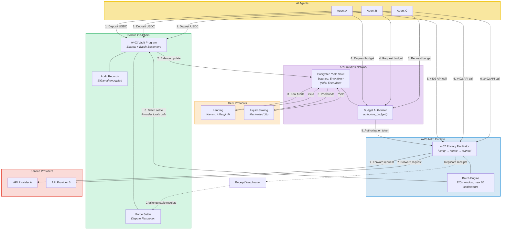
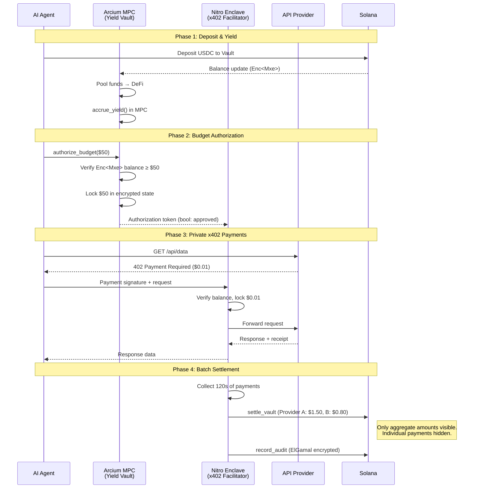
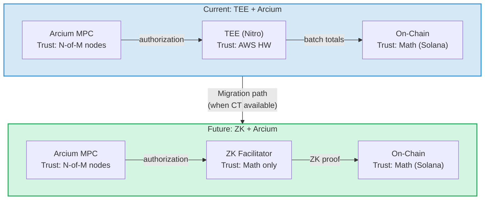

# Architecture Diagrams

## 1. System Overview



## 2. Payment Flow (Sequence)



## 3. Privacy Boundaries

```mermaid
graph LR
    subgraph visible["On-Chain (Public)"]
        V1["Vault TVL: $100K"]
        V2["Batch: Provider A → $1,500"]
        V3["Batch: Provider B → $800"]
        V4["Audit: ElGamal ciphertext"]
    end

    subgraph arcium_hidden["Arcium MPC (Hidden from everyone)"]
        H1["Agent A balance: $5,000"]
        H2["Agent B balance: $3,200"]
        H3["Agent A yield: $45.20"]
        H4["Yield strategy allocation"]
    end

    subgraph tee_hidden["TEE (Hidden from on-chain)"]
        T1["Agent A → Provider A: $0.50"]
        T2["Agent B → Provider A: $1.00"]
        T3["Agent A → Provider B: $0.80"]
        T4["Payment frequency patterns"]
    end

    visible ~~~ arcium_hidden ~~~ tee_hidden

    style visible fill:#d5f5e3,stroke:#27ae60,stroke-width:2px
    style arcium_hidden fill:#e8d5f5,stroke:#9b59b6,stroke-width:2px
    style tee_hidden fill:#d5e8f5,stroke:#3498db,stroke-width:2px
```



## 4. Trust Model Comparison



## 5. Arcium Yield Vault Detail

```mermaid
graph TB
    subgraph vault["Arcium Encrypted Vault"]
        direction TB
        DEP["deposit()<br/><i>Enc&lt;Shared&gt; → Enc&lt;Mxe&gt;</i>"]
        YIELD["accrue_yield()<br/><i>Enc&lt;Mxe&gt; → Enc&lt;Mxe&gt;</i>"]
        AUTHZ["authorize_budget()<br/><i>Enc&lt;Shared&gt; + Enc&lt;Mxe&gt; → bool.reveal()</i>"]
        RECON["reconcile()<br/><i>TEE consumed → update Enc&lt;Mxe&gt;</i>"]
        BAL["reveal_balance()<br/><i>Enc&lt;Mxe&gt; → Enc&lt;Shared&gt; (owner only)</i>"]

        DEP --> YIELD --> AUTHZ --> RECON
        BAL -.-> DEP
    end

    AGENT["AI Agent"] -- "encrypt(amount)" --> DEP
    AGENT -- "encrypt(budget)" --> AUTHZ
    DEFI["DeFi Yield"] -- "Enc<Mxe>" --> YIELD
    AUTHZ -- "bool: approved" --> FACIL["TEE Facilitator"]
    RECON <-- "consumed amounts" --- FACIL
    AGENT -- "decrypt(own balance)" --> BAL

    style vault fill:#e8d5f5,stroke:#9b59b6,stroke-width:2px
```
