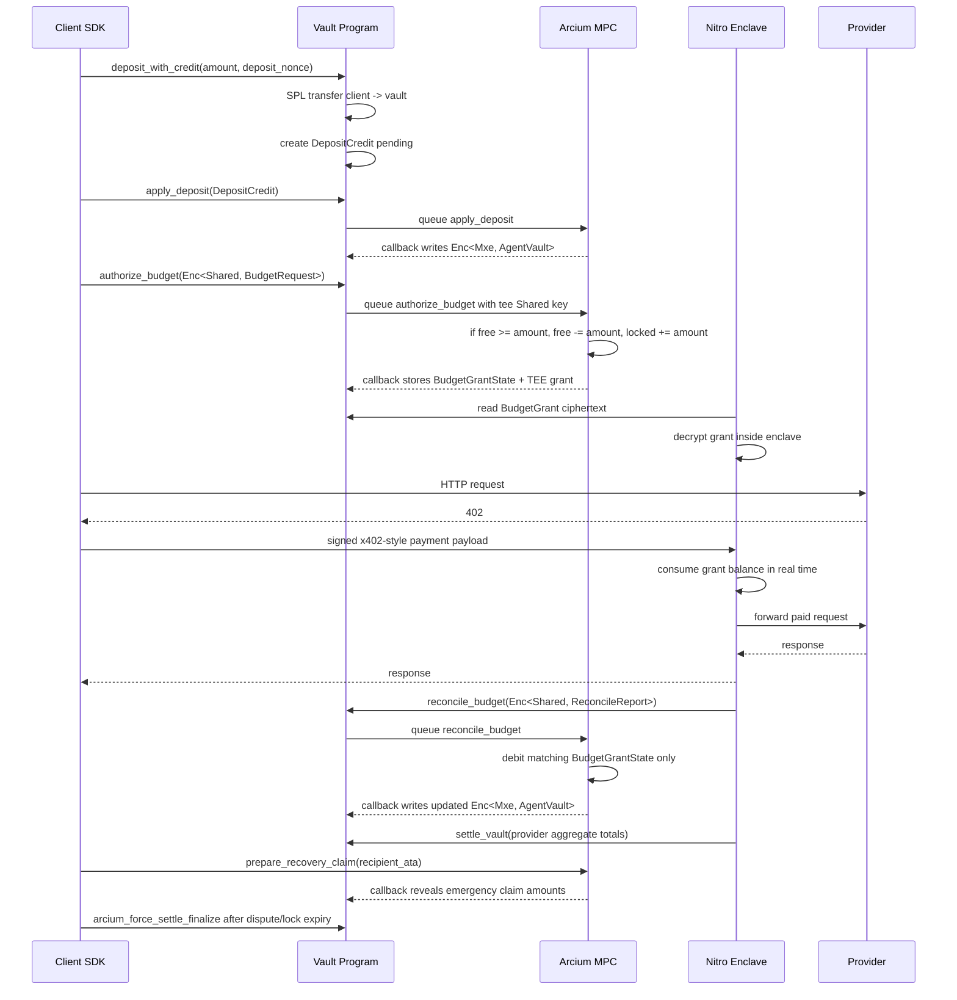

# Phase 5 Arcium Design

## 1. Scope

Phase 5 adds Arcium MPC as the encrypted accounting layer for Subly402's yield
vault. It does not try to hide the initial SPL Token deposit, because Token-2022
Confidential Transfer is out of scope for this phase.

The design goal is:

- Keep the existing `subly402_vault` escrow and batched provider settlement.
- Move per-client balance, yield, and budget authorization state into
  Arcium `Enc<Mxe, T>` state.
- Let the Nitro Enclave process x402 requests in real time using pre-authorized
  budget grants, not by holding the full client balance ledger.
- Keep on-chain payment settlement at provider aggregate granularity.

Non-goals:

- Hiding `client -> vault` deposit address or amount.
- Hiding vault-level TVL, public DeFi strategy positions, or provider aggregate
  payouts.
- Replacing the TEE for real-time x402 request forwarding in this phase.
- Making force-settle privacy-preserving. Force-settle is an emergency recovery
  path and may reveal the participant's claim values when used.

## 2. Privacy Model

| Data | Phase 5 treatment |
| --- | --- |
| Initial deposit tx | Public SPL transfer remains visible |
| Client current free balance | Stored as Arcium `Enc<Mxe>` |
| Client locked budget | Stored as Arcium `Enc<Mxe>` |
| Client yield earned | Stored as Arcium `Enc<Mxe>` |
| Budget amount authorized to TEE | Returned as `Enc<Shared>` to the attested enclave key |
| Individual client payment amount | Hidden on-chain by existing TEE batching |
| Provider aggregate payout | Public in `settle_vault` |
| Emergency client recovery amount | Public only if client opens an Arcium recovery claim |

The important boundary is:

- Arcium protects money-at-rest accounting: balance, yield, authorization.
- TEE protects money-in-motion workflow: HTTP request, provider forwarding,
  response delivery, and batch construction.

## 3. Architecture



## 4. Account Model

Do not reallocate `VaultConfig` for Phase 5. Add separate PDAs so existing vaults
can be upgraded without migrating the main account layout.

### ArciumConfig

Seed: `[b"arcium_config", vault_config]`

Purpose: binds one vault to one Arcium deployment and one attested TEE encryption
identity.

Fields:

- `bump: u8`
- `vault_config: Pubkey`
- `status: u8` (`disabled`, `mirror`, `enforced`, `paused`; `enforced` is
  rejected until legacy bypass paths are removed)
- `arcium_program_id: Pubkey`
- `mxe_account: Pubkey`
- `cluster_account: Pubkey`
- `mempool_account: Pubkey`
- `comp_def_version: u32`
- `tee_x25519_pubkey: [u8; 32]`
- `attestation_policy_hash: [u8; 32]`
- `strategy_controller: Pubkey`
- `last_recorded_yield_epoch: u64`
- `current_yield_index_q64: u128`
- `min_liquid_reserve_bps: u16`
- `max_strategy_allocation_bps: u16`
- `settlement_buffer_amount: u64`
- `strategy_withdrawal_sla_sec: u64`

The enclave attestation must include `tee_x25519_pubkey`,
`arcium_program_id`, `mxe_account`, and `comp_def_version`. Clients must verify
these values before accepting budget grants.

### ClientVaultState

Seed: `[b"client_vault_state", vault_config, client]`

Purpose: persistent encrypted per-client vault state.

Fields:

- `bump: u8`
- `vault_config: Pubkey`
- `client: Pubkey`
- `status: u8` (`idle`, `pending`, `closed`)
- `state_version: u64`
- `pending_offset: u64`
- `agent_vault_ciphertexts: [[u8; 32]; AGENT_VAULT_SCALARS]`
- `agent_vault_nonce: [u8; 16]`

`status = pending` serializes Arcium writes per client. A callback must only
write if the computation offset matches `pending_offset`, then increment
`state_version` and return to `idle`.

### DepositCredit

Seed: `[b"deposit_credit", vault_config, client, deposit_nonce]`

Purpose: makes SPL deposits idempotent before they are reflected into encrypted
Arcium state.

Fields:

- `bump: u8`
- `vault_config: Pubkey`
- `client: Pubkey`
- `deposit_nonce: u64`
- `amount: u64`
- `status: u8` (`pending`, `applied`, `cancelled`)
- `created_at: i64`
- `applied_state_version: u64`

The Phase 5 deposit instruction must create this PDA in the same transaction as
the SPL token transfer. `apply_deposit_callback` may update encrypted state only
from a `pending` credit and must mark it `applied`. Replays with the same
`deposit_nonce` fail at PDA creation or see `status != pending`.

### BudgetGrant

Seed: `[b"budget_grant", client_vault_state, budget_id]`

Purpose: stores both the encrypted grant returned to the enclave and the
Arcium-owned encrypted grant state used for later reconciliation.

Fields:

- `bump: u8`
- `vault_config: Pubkey`
- `client_vault_state: Pubkey`
- `client: Pubkey`
- `budget_id: u64`
- `request_nonce: u64`
- `status: u8` (`pending`, `ready`, `reconciling`, `closed`, `expired`, `cancelled`)
- `created_at: i64`
- `expires_at: i64`
- `state_version_at_authorization: u64`
- `grant_state_ciphertexts: [[u8; 32]; BUDGET_GRANT_STATE_SCALARS]`
- `grant_state_nonce: [u8; 16]`
- `grant_ciphertexts: [[u8; 32]; BUDGET_GRANT_SCALARS]`
- `grant_nonce: [u8; 16]`

The `grant_ciphertexts` plaintext is only decryptable by the attested enclave
key. The `grant_state_ciphertexts` plaintext is `Enc<Mxe, BudgetGrantState>` and
is the source of truth for authorized amount, remaining amount, and consumed
amount. Reconciliation must consume this grant state, not the client's aggregate
`locked` balance directly.

### WithdrawalGrant

Seed: `[b"withdrawal_grant", client_vault_state, withdrawal_id]`

Purpose: same pattern as `BudgetGrant`, but authorizes one public `withdraw`
instruction instead of x402 request spending.

Fields:

- `bump: u8`
- `vault_config: Pubkey`
- `client_vault_state: Pubkey`
- `client: Pubkey`
- `withdrawal_id: u64`
- `status: u8` (`pending`, `ready`, `reconciling`, `closed`, `expired`, `cancelled`)
- `recipient_ata: Pubkey`
- `expires_at: i64`
- `grant_state_ciphertexts: [[u8; 32]; WITHDRAWAL_GRANT_STATE_SCALARS]`
- `grant_state_nonce: [u8; 16]`
- `grant_ciphertexts: [[u8; 32]; WITHDRAWAL_GRANT_SCALARS]`
- `grant_nonce: [u8; 16]`

### YieldEpoch

Seed: `[b"yield_epoch", vault_config, epoch_id]`

Purpose: records a public harvest event and advances the vault's cumulative
yield index.

Fields:

- `bump: u8`
- `vault_config: Pubkey`
- `epoch_id: u64`
- `realized_yield_amount: u64`
- `total_eligible_shares: u64`
- `previous_yield_index_q64: u128`
- `new_yield_index_q64: u128`
- `strategy_receipt_hash: [u8; 32]`
- `status: u8` (`open`, `closed`)

`realized_yield_amount` and `total_eligible_shares` are vault-level values and
may be public. Per-client yield deltas are computed lazily inside MPC from
`new_yield_index_q64 - AgentVault.yield_index_checkpoint_q64`, so deposits after
an epoch do not receive that epoch's yield.

### RecoveryClaim

Seed: `[b"recovery_claim", client_vault_state, recovery_nonce]`

Purpose: Arcium-native emergency recovery path for clients when the enclave is
unavailable or no longer trusted.

Fields:

- `bump: u8`
- `vault_config: Pubkey`
- `client_vault_state: Pubkey`
- `client: Pubkey`
- `recipient_ata: Pubkey`
- `recovery_nonce: u64`
- `status: u8` (`pending`, `ready`, `finalized`, `cancelled`)
- `free_balance_due: u64`
- `locked_balance_due: u64`
- `max_lock_expires_at: i64`
- `state_version: u64`
- `initiated_at: i64`
- `dispute_deadline: i64`

The callback for `prepare_recovery_claim` reveals these claim amounts publicly
and moves `ClientVaultState.status` to `closed`. This is an explicit privacy
trade-off for asset recovery. Provider force-settle remains on the existing
participant receipt path because provider credit is still produced by the TEE.

## 5. Encrypted Circuit State

Use a small, fixed-width state struct to keep callback payloads predictable.

```rust
pub struct AgentVault {
    pub free: u64,
    pub locked: u64,
    pub yield_earned: u64,
    pub spent: u64,
    pub withdrawn: u64,
    pub strategy_shares: u64,
    pub max_lock_expires_at: u64,
    pub yield_index_checkpoint_q64: u128,
}
```

`AGENT_VAULT_SCALARS = 8`, so the encrypted state is 256 bytes of ciphertext
plus the nonce. This still fits the current Phase 5 need without packing.

Budget request and grant structs:

```rust
pub struct BudgetRequest {
    pub domain_hash_lo: u128,
    pub domain_hash_hi: u128,
    pub budget_id: u64,
    pub request_nonce: u64,
    pub amount: u64,
    pub expires_at: u64,
}

pub struct BudgetGrantView {
    pub approved: u8,
    pub budget_id: u64,
    pub request_nonce: u64,
    pub amount: u64,
    pub remaining: u64,
    pub expires_at: u64,
    pub state_version: u64,
    pub domain_hash_lo: u128,
    pub domain_hash_hi: u128,
    pub vault_config_lo: u128,
    pub vault_config_hi: u128,
    pub client_lo: u128,
    pub client_hi: u128,
    pub budget_grant_lo: u128,
    pub budget_grant_hi: u128,
}

pub struct BudgetGrantState {
    pub budget_id: u64,
    pub request_nonce: u64,
    pub authorized: u64,
    pub remaining: u64,
    pub consumed: u64,
    pub refunded: u64,
    pub expires_at: u64,
    pub last_report_nonce: u64,
    pub status: u8,
}

pub struct ReconcileReport {
    pub domain_hash_lo: u128,
    pub domain_hash_hi: u128,
    pub budget_id: u64,
    pub request_nonce: u64,
    pub report_nonce: u64,
    pub consumed_delta: u64,
    pub refund_remaining: u8,
}

pub struct WithdrawalReport {
    pub domain_hash_lo: u128,
    pub domain_hash_hi: u128,
    pub withdrawal_id: u64,
    pub withdrawn: u64,
    pub refunded: u64,
}

pub struct RecoveryClaimPlaintext {
    pub free_balance_due: u64,
    pub locked_balance_due: u64,
    pub max_lock_expires_at: u64,
    pub state_version: u64,
}
```

Use `u8` instead of enums in circuits. Use `u64` timestamps instead of `i64`
inside Arcis.

Every encrypted request/report includes a domain hash. The hash is derived from:

- instruction kind
- `vault_config`
- asset mint
- program id
- `arcium_program_id`
- `mxe_account`
- `tee_x25519_pubkey`
- `attestation_policy_hash`
- `comp_def_version`

Queue instructions derive the expected domain hash from public accounts and pass
it into MPC. Callers never supply this value. Circuits must reject encrypted
inputs whose domain hash does not match the program-derived value. This prevents
cross-vault, cross-network, and stale TEE-key replay when the configured
attestation policy commits to the deployment domain.

## 6. Circuit Set

Every circuit follows the Arcium pattern:

1. `init_<name>_comp_def`
2. `<name>` queue instruction
3. `<name>_callback` state write

All queue instructions must enforce account authority before queuing:

- client-owned operations require `client` signer and
  `ClientVaultState.client == client`.
- enclave reconciliation operations require the current `vault_signer` signer
  and the TEE key pinned in `ArciumConfig`.
- strategy/yield-index updates require governance or strategy-controller
  authority.
- callbacks verify `SignedComputationOutputs`, `pending_offset`, pending client
  status, and writable callback accounts.

Every state-mutating circuit first applies pending public yield:

```rust
fn settle_pending_yield(state: AgentVault, current_yield_index_q64: u128) -> AgentVault {
    // Conceptual helper. Implement with safe arithmetic and no early returns.
    // delta = state.strategy_shares * (current_index - checkpoint) / 2^64
}
```

This avoids per-client epoch snapshots. Deposits and share changes first settle
yield at the current index, then mutate `strategy_shares`.

### init_agent_vault

Creates the first `Enc<Mxe, AgentVault>`.

Input:

- none, or public initial zero constants

Output:

- `Enc<Mxe, AgentVault>`

Callback:

- writes zero encrypted state to `ClientVaultState`
- sets `state_version = 1`
- sets `yield_index_checkpoint_q64` to the current vault yield index

### apply_deposit

Applies a confirmed SPL deposit to encrypted state.

Input:

- `state: Enc<Mxe, AgentVault>`
- `deposit_credit.amount: u64` from a `DepositCredit` PDA
- `deposit_nonce: u64`
- `current_yield_index_q64: u128`

Logic:

- require the queue instruction uses `DepositCredit.status == pending`
- set `amount = DepositCredit.amount`
- call `settle_pending_yield(state, current_yield_index_q64)`
- if pending-yield settlement, `state.free + amount`, or
  `state.strategy_shares + amount` would overflow, leave state unchanged and
  return a failed public callback status
- otherwise `state.free += amount`
- `state.strategy_shares += amount` while Phase 5 uses 1 USDC atomic unit as 1
  strategy share

Callback:

- on success, writes updated encrypted state
- on success, increments `state_version`
- on success, marks `DepositCredit.status = applied`
- on success, records `DepositCredit.applied_state_version = state_version`
- on failure, clears the pending client state and leaves `DepositCredit.status =
  pending` so it can be investigated or retried

The public amount is already visible in the SPL transfer, so encrypting this
particular input does not improve privacy.

### record_yield_epoch

Records a vault-level harvest and advances the public cumulative yield index.
This is an on-chain instruction, not an Arcium computation.

Input:

- `epoch_id: u64`
- `realized_yield_amount: u64`
- `total_eligible_shares: u64`
- `strategy_receipt_hash: [u8; 32]`

Logic:

- require strategy-controller or governance signer
- require `epoch_id == previous_epoch_id + 1`
- if `total_eligible_shares == 0`, keep the yield index unchanged and hold the
  realized yield in protocol reserve
- otherwise:
  - `index_delta_q64 = realized_yield_amount * 2^64 / total_eligible_shares`
  - `new_yield_index_q64 = previous_yield_index_q64 + index_delta_q64`

Per-client yield is not processed here. Each client state applies pending yield
inside the next Arcium state transition via `settle_pending_yield`.

### settle_yield

Permissionless maintenance circuit that applies pending yield to one client
without changing budget, withdrawal, or shares.

Input:

- `state: Enc<Mxe, AgentVault>`
- `current_yield_index_q64: u128`

Logic:

- call `settle_pending_yield(state, current_yield_index_q64)`

Callback:

- on success, writes updated encrypted state
- on success, increments `state_version`
- on failure, clears the pending client state without advancing `state_version`

This circuit is optional for correctness because all other state-mutating
circuits settle pending yield first. It is useful before `owner_view` or
recovery claims.

### authorize_budget

Pre-authorizes an x402 spend bucket for the enclave.

Input:

- `state: Enc<Mxe, AgentVault>`
- `request: Enc<Shared, BudgetRequest>` from the client
- `tee: Shared` using the attested enclave x25519 public key
- `current_yield_index_q64: u128`
- program-derived expected request domain hash
- public `budget_id`, `request_nonce`, and `expires_at` for PDA derivation and
  replay protection

Logic:

- decrypt request in MPC
- require request domain hash matches the public expected domain hash
- require encrypted `budget_id`, `request_nonce`, and `expires_at` match the
  public instruction values
- call `settle_pending_yield(state, current_yield_index_q64)`
- `approved = state.free >= request.amount && request.amount > 0`
- `approved = approved && state.locked + request.amount does not overflow`
- if approved:
  - `state.free -= request.amount`
  - `state.locked += request.amount`
- create `BudgetGrantState { authorized, remaining, consumed = 0, status = ready }`
- encrypt grant to `tee`
- bind `BudgetGrantView` to the domain hash, `vault_config`, client, and
  `BudgetGrant` account
- update `state.max_lock_expires_at = max(state.max_lock_expires_at, request.expires_at)`

Output:

- updated `Enc<Mxe, AgentVault>`
- `Enc<Mxe, BudgetGrantState>`
- `Enc<Shared, BudgetGrantView>` for the enclave

Callback:

- writes updated client state; rejected requests write the unchanged state but
  still advance `state_version`
- writes encrypted grant state to `BudgetGrant`
- writes grant ciphertext to `BudgetGrant`
- sets `BudgetGrant.status = ready`

The budget amount is not revealed on-chain. The enclave learns it only after
decrypting the grant inside the attested runtime. Approval status is also only
visible to the enclave via `BudgetGrantView.approved`.

### reconcile_budget

Reconciles what the enclave actually consumed from an authorized budget.

Input:

- `state: Enc<Mxe, AgentVault>`
- `grant_state: Enc<Mxe, BudgetGrantState>`
- `report: Enc<Shared, ReconcileReport>` from the enclave key
- program-derived expected report domain hash
- public `budget_id` and `request_nonce` from the `BudgetGrant`

Logic:

- decrypt report in MPC
- decrypt grant state in MPC
- require report domain hash matches the public expected domain hash
- require `report.budget_id == grant_state.budget_id`
- require `report.request_nonce == grant_state.request_nonce`
- require `report.report_nonce > grant_state.last_report_nonce`
- require report identifiers match the public `BudgetGrant`
- require `grant_state.status == ready`
- validate against this grant, not aggregate client lock:
  - `report.consumed_delta <= grant_state.remaining`
  - if `report.refund_remaining == 1`, refund exactly
    `grant_state.remaining - report.consumed_delta`
  - otherwise refund `0`
- if valid:
  - `debit = report.consumed_delta + refund`
  - `state.locked -= debit`
  - `state.free += refund`
  - `state.spent += report.consumed_delta`
  - `grant_state.remaining -= debit`
  - `grant_state.consumed += report.consumed_delta`
  - `grant_state.refunded += refund`
  - `grant_state.last_report_nonce = report.report_nonce`
  - close grant when `grant_state.remaining == 0`
- otherwise leave state and grant state unchanged and emit a public failure
  status

Callback:

- on success, writes updated client state
- on success, writes updated encrypted grant state
- on success, marks `BudgetGrant` closed only if `grant_state.remaining == 0`;
  otherwise it stays `ready`
- on failure, clears the pending client state and returns `BudgetGrant.status`
  to `ready` for retry

### authorize_withdrawal

Same shape as `authorize_budget`, but the encrypted grant authorizes the enclave
to sign the existing on-chain `withdraw` instruction.

Input:

- encrypted withdrawal request
- state
- TEE shared key
- current yield index
- public expected request domain hash

Logic:

- require client signer and matching request domain hash
- call `settle_pending_yield(state, current_yield_index_q64)`
- if `free >= amount`, move `free -> locked`
- update `max_lock_expires_at`
- return enclave-encrypted withdrawal grant

The actual `withdraw` instruction remains the existing vault token transfer
authorized by the enclave signer. After confirmation, `reconcile_withdrawal`
reduces `locked` and increases `withdrawn`. On expiry/failure, it refunds locked
amount to `free`.

### reconcile_withdrawal

Reconciles an enclave-authorized withdrawal after the public `withdraw`
instruction either confirms or expires.

Input:

- `state: Enc<Mxe, AgentVault>`
- encrypted withdrawal grant state
- `report: Enc<Shared, WithdrawalReport>` from the enclave key
- public expected report domain hash

Logic:

- require enclave signer and matching report domain hash
- validate `withdrawn + refunded <= withdrawal_grant.remaining` without overflowing
- on confirmed withdrawal:
  - `state.locked -= withdrawn`
  - `state.withdrawn += withdrawn`
- on failed or expired withdrawal:
  - `state.locked -= refunded`
  - `state.free += refunded`

Callback:

- writes updated client state
- marks the withdrawal grant consumed or expired

### owner_view

Returns an owner-encrypted balance view for the SDK.

Input:

- `state: Enc<Mxe, AgentVault>`
- `owner: Shared`
- current yield index

Output:

- `Enc<Shared, AgentVault>` or a smaller `AgentVaultView`, plus a public success
  status

The queue instruction must require the client signer. Normal `/balance` should
stop returning plaintext in enforced mode. The SDK can decrypt this owner view
locally.
If pending-yield settlement overflows, the callback clears the pending state and
does not emit a stale owner view.

### prepare_recovery_claim

Emergency client recovery circuit. This replaces client-side plaintext
participant receipts in enforced mode.

Input:

- `state: Enc<Mxe, AgentVault>`
- `recovery_nonce: u64`
- `recipient_ata: Pubkey`
- current yield index

Logic:

- require client signer and `ClientVaultState.status == idle`
- require a pre-created `RecoveryClaim` with `status == pending`
- call `settle_pending_yield(state, current_yield_index_q64)`
- reveal `free`, `locked`, `max_lock_expires_at`, and `state_version`
- queue instruction sets `ClientVaultState.status = pending` to block concurrent
  writes

Callback:

- writes a public `RecoveryClaim`
- sets `ClientVaultState.status = closed`
- no further budget, withdrawal, deposit, or yield-settle operations are allowed
  for that client state

Finalize:

- after `dispute_deadline`, transfer `free_balance_due`
- after `max_lock_expires_at`, transfer `locked_balance_due`
- do not partial-pay if the vault token account is insolvent

This path intentionally reveals the recovering client's claim amount. It exists
to preserve asset recovery when the TEE is down and cannot issue fresh receipts.

## 7. Enclave Changes

Phase 5 should be rolled out in two modes.

### Mirror Mode

Mirror mode keeps current enclave balances authoritative while Arcium state is
updated in parallel.

Use this for:

- circuit correctness testing
- callback/retry hardening
- SDK encryption key derivation
- devnet demos

TEE behavior:

- continues using existing `ClientBalance`
- subscribes to Arcium callback events
- compares decrypted owner test fixtures only in non-production test mode

### Enforced Mode

Enforced mode makes Arcium budget grants authoritative for new payments.

TEE behavior:

- no longer needs full client balances for request authorization
- stores `budget_id -> remaining_amount, expires_at` after decrypting
  `BudgetGrant`
- `/verify` consumes from remaining authorized budget
- `/settle` records provider credit as today
- periodically submits `reconcile_budget`
- signs provider participant receipts for unbatched provider credit as today
- does not sign authoritative full-balance client recovery receipts; client
  recovery uses `prepare_recovery_claim`
- rejects or cancels local budget grants once it observes
  `ClientVaultState.status == closed`

The attestation document must bind:

- `vault_signer_pubkey`
- `tee_x25519_pubkey`
- `arcium_program_id`
- `mxe_account`
- `comp_def_version`
- `attestation_policy_hash`

The attestation document also commits to the domain-hash derivation used by
client requests and enclave reconcile reports.

## 8. Deposit and Yield Flow

### Deposit

1. Client sends Phase 5 `deposit_with_credit(amount, deposit_nonce)` to
   `subly402_vault`.
2. Vault transfers SPL tokens into the vault token account.
3. Vault creates `DepositCredit(vault, client, deposit_nonce)` with
   `status = pending`.
4. Client submits `apply_deposit` for the pending credit, preferably in the same
   transaction when account limits allow it.
5. `apply_deposit_callback` writes encrypted state and marks the credit
   `applied`.
6. Deposit is not considered spendable in enforced mode until the Arcium callback
   updates encrypted state.

This preserves the current on-chain deposit model and avoids pretending deposit
privacy exists before Confidential Transfer is available. It also makes Arcium
crediting idempotent; retrying can requeue a pending credit, but it cannot apply
the same deposit twice.

### Yield

Phase 5 yield uses a public cumulative index:

1. Strategy controller harvests realized yield.
2. Governance or strategy controller creates a `YieldEpoch` with public
   `realized_yield_amount`, `total_eligible_shares`, and
   `strategy_receipt_hash`.
3. The instruction advances `new_yield_index_q64`.
4. Each client state lazily applies pending yield before any deposit, budget,
   withdrawal, owner view, or recovery claim.

This keeps per-client yield private while leaving vault-level strategy accounting
auditable. It also avoids the stale-snapshot bug where a deposit after harvest
could accidentally receive old yield.

## 9. Invariants

Client encrypted accounting:

- `free + locked` is the client's unwithdrawn liability plus accrued yield minus
  spent amount.
- `authorize_budget` and `authorize_withdrawal` can only move `free -> locked`.
- `reconcile_budget` can only move `locked -> spent` or `locked -> free`.
- `reconcile_withdrawal` can only move `locked -> withdrawn` or `locked -> free`.
- yield settlement can only increase `free` and `yield_earned`.
- A client state can have at most one pending Arcium computation at a time.
- Arithmetic overflow must produce a no-op encrypted failure status, not wrapped
  state.
- `DepositCredit` can be applied at most once.
- A reconcile report can only debit the matching `BudgetGrantState`, never the
  client's aggregate `locked` balance directly.
- `BudgetGrantState.authorized = remaining + consumed + refunded`.
- `prepare_recovery_claim` is terminal for a `ClientVaultState`.

Vault-level solvency:

- `vault_token_account.amount + strategy_liquidation_value` must cover provider
  credits plus encrypted client liabilities.
- Because client liabilities are encrypted, operational solvency monitoring
  remains an enclave/governance responsibility in Phase 5.
- `settle_vault` still fails rather than partially paying if the vault token
  account is insufficient.
- Governance must configure a public liquidity policy:
  - `min_liquid_reserve_bps`
  - `max_strategy_allocation_bps`
  - `settlement_buffer_amount`
  - `strategy_withdrawal_sla_sec`
- Strategy allocation must leave enough liquid USDC for expected provider
  settlement and near-term recovery claims.

## 10. Failure Handling

Arcium callback delayed:

- Client deposit or budget request remains pending.
- SDK should surface `deposit_sync_in_progress` / `budget_sync_in_progress`.

Computation fails:

- Keep `ClientVaultState.status = pending` until callback or timeout clearing.
- `cancel_pending_arcium` can clear a timed-out non-budget computation after
  `ARCIUM_PENDING_TIMEOUT_SEC`.
- `cancel_pending_budget` can cancel a timed-out pending authorization or return
  a timed-out reconciling grant to `ready`.
- Timeout clearing must not write a new encrypted state; it only unlocks retry.

TEE restart:

- TEE restores decrypted budget grants and remaining amounts from encrypted WAL.
- If WAL is incomplete, TEE must re-read `BudgetGrant` accounts and decrypt them
  inside the enclave.

Stale budget grant:

- TEE rejects grants with expired `expires_at`.
- Expired grants are reconciled with `consumed_delta = newly_consumed_amount`
  and `refund_remaining = 1`.

Force settle:

- Provider recovery stays on the existing receipt/watchtower path.
- Client recovery in enforced mode uses `prepare_recovery_claim` and
  `arcium_force_settle_finalize`.
- Privacy is intentionally weaker on this path because liveness and asset
  recovery take priority.

Timing correlation:

- Enforced mode should prefer long-lived budget buckets over per-request
  on-demand grants.
- SDK defaults should top up budget in coarse increments and reconcile unused
  budget on expiry or when the remaining amount falls below a threshold.
- Public `BudgetGrant` creation time is visible, so it must not be treated as
  request-level private metadata.

## 11. Arcium Implementation Notes

- Use persistent `Enc<Mxe, AgentVault>` for client state.
- Use `Enc<Shared, T>` for client requests and enclave-readable outputs.
- Use a fresh 16-byte nonce for every encryption.
- Keep ArgBuilder ordering identical to each circuit signature.
- Include `.x25519_pubkey()` for every `Enc<Shared, T>` parameter.
- Store each encrypted scalar as its own `[u8; 32]`.
- Avoid variable-length loops, `Vec`, `String`, `Option`, and enums in circuits.
- Keep maintenance computations one-client-at-a-time to avoid callback size
  limits.
- Callback accounts must be pre-created and writable; callbacks must not create
  or resize accounts.

## 12. Implementation Order

1. Add Arcium project structure:
   - `encrypted-ixs/src/lib.rs`
   - Arcium dependencies in the Anchor program
   - generated account structs and comp definition init instructions
2. Add account types:
   - `ArciumConfig`
   - `ClientVaultState`
   - `DepositCredit`
   - `BudgetGrant`
   - `WithdrawalGrant`
   - `YieldEpoch`
   - `RecoveryClaim`
3. Implement mirror-mode circuits:
   - `init_agent_vault`
   - `apply_deposit`
   - `settle_yield`
   - `owner_view`
4. Add SDK encryption helpers:
   - derive recoverable x25519 key from wallet signature
   - fetch MXE public key with retry
   - encrypt budget requests with fresh nonces
5. Implement budget authorization:
   - `authorize_budget` on-chain path
   - `reconcile_budget` on-chain path
   - encrypted `BudgetGrantState`
   - enclave grant decryption and grant cache
6. Switch devnet to enforced mode behind config:
   - require valid `BudgetGrant` for `/verify`
   - stop returning plaintext `/balance` by default
7. Add yield epochs:
   - `YieldEpoch`
   - public cumulative yield index
   - strategy controller integration
8. Add withdrawal authorization:
   - `authorize_withdrawal`
   - `reconcile_withdrawal`
9. Add Arcium-native client recovery:
   - `prepare_recovery_claim`
   - `arcium_force_settle_finalize`

## 13. Test Plan

Circuit tests:

- initializes zero state
- deposit increases `free` and `strategy_shares`
- budget approval locks funds
- insufficient budget request leaves state unchanged
- reconcile can only debit the matching encrypted `BudgetGrantState`
- replayed reconcile reports with stale `report_nonce` are rejected
- replayed or cross-vault domain hashes are rejected
- yield index settlement increases `free` and `yield_earned`
- deposits after a yield epoch do not receive old yield
- recovery claim reveals the current settled `free`, `locked`, and lock expiry

Anchor tests:

- comp definition init works for every circuit
- callback writes only matching `pending_offset`
- stale callback cannot overwrite newer state
- `ClientVaultState` rejects concurrent computations
- `DepositCredit` cannot be applied twice
- `BudgetGrant` ciphertext is written and status moves to `ready`
- caller-supplied domain hashes are not accepted by budget instructions
- timed-out pending Arcium operations can be cancelled without writing encrypted
  state
- `RecoveryClaim` finalization waits for dispute and lock expiry

Enclave tests:

- attestation includes Arcium public config
- enclave decrypts budget grant and consumes it across multiple requests
- request is rejected after budget is exhausted
- reconcile refunds unused budget after expiry
- restart reloads grant state from WAL or on-chain grant accounts
- client recovery does not require a fresh TEE-signed balance receipt in enforced
  mode

End-to-end tests:

- deposit is visible, but balance/yield are only ciphertext on-chain
- budget amount is not visible on-chain
- individual client-to-provider payment remains absent from chain
- provider aggregate settlement remains visible
- provider force-settle still recovers funds under the existing receipt model
- client force-settle recovers via Arcium `RecoveryClaim`

## 14. Open Decisions

1. Same program vs companion program:
   - Preferred: integrate Arcium into `subly402_vault` so callbacks write vault
     state directly.
   - Fallback: companion program for mirror mode if Arcium macros make the
     existing Anchor module too invasive.
2. Yield share source:
   - MVP: `strategy_shares += deposit_amount`.
   - Later: separate deposit, withdrawal, and strategy share accounting once
     real DeFi strategy positions are integrated.
3. Public budget metadata:
   - Preferred: budget amount only appears in the enclave-encrypted grant.
   - Acceptable fallback: fixed-size public budget buckets if grant encryption
     becomes too heavy for the first devnet milestone.
4. Strict `/balance` behavior:
   - Preferred: SDK decrypts `owner_view`.
   - Fallback: enclave returns plaintext balance only when explicitly configured
     for devnet/demo mode.
5. Client recovery UX:
   - Preferred: SDK exposes recovery as an explicit emergency action because it
     reveals claim amounts.
   - Fallback: keep TEE-signed client receipts enabled in enforced mode as a
     compatibility bridge, while documenting that this lets the TEE observe
     full balances.
